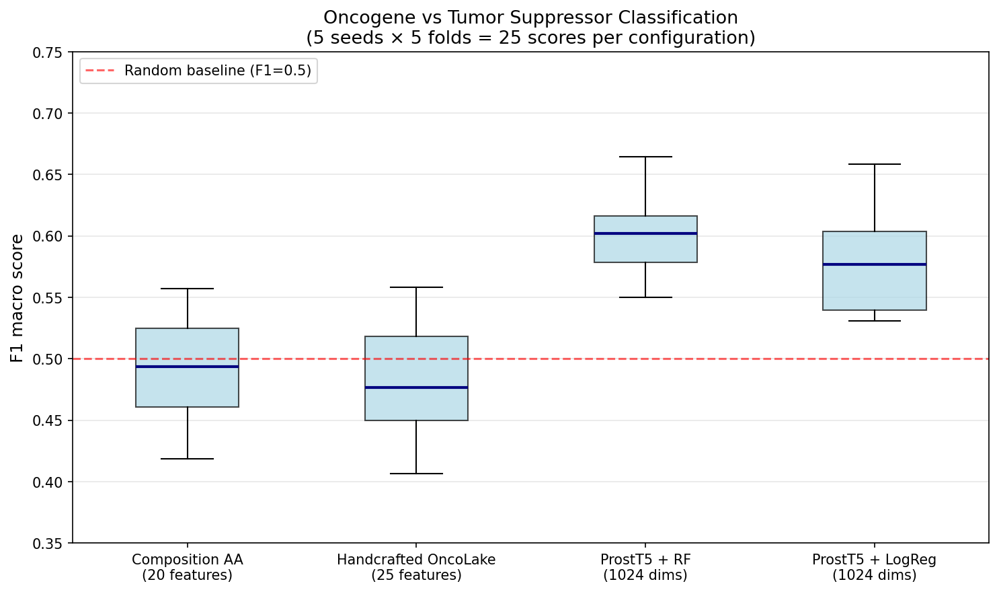

# Oncolake × ProstT5 : Learned Structural Embeddings for Cancer Protein Classification

> **Note on the pivot from TorchProtein.** This project originally planned to use
TorchProtein (Jian Tang lab, Mila) to compute GNN-based structural embeddings.
Due to compatibility issues between TorchDrug (last major release 2023) and
current PyTorch/CUDA versions, the project was pivoted to ProstT5
(Heinzinger et al., 2023), a more recent Transformer-based model that encodes
protein 3D structure via Foldseek's 3Di alphabet. The scientific question
and evaluation protocol remained unchanged. See "Methodological choices"
below for the full rationale.
> 

## Research question

> Do learned geometric embeddings capture structural signal that handcrafted
AlphaFold features miss?
> 

## Answer (spoiler)

**Yes**, with strong statistical evidence.



### Key numbers

| Representation | Classifier | F1 macro | MCC | p-value vs handcrafted |
| --- | --- | --- | --- | --- |
| Composition AA (20 features) | RF | 0.489 ± 0.042 | -0.012 | — |
| Handcrafted OncoLake (25 features) | RF | 0.482 ± 0.048 | -0.031 | — |
| **ProstT5 (1024 dims)** | **RF** | **0.598 ± 0.031** | **0.205** | **< 10⁻⁷** |
| ProstT5 (1024 dims) | LogReg | 0.582 ± 0.046 | 0.173 | < 10⁻⁷ |

Wilcoxon signed-rank paired test on 25 F1 macro scores (5 seeds × 5 folds).

## Method

The dataset consists of 404 human cancer-related proteins from UniProt, split
into oncogenes (225) and tumor suppressors (179), each with an AlphaFold
structure prediction. Three representations are compared under the same
evaluation protocol:

1. **Amino acid composition** (20 features) : sequence-only baseline
2. **Handcrafted OncoLake** (25 features) : AA composition + global
structural descriptors (radius of gyration, pLDDT statistics)
3. **ProstT5 embeddings** (1024 dims) : learned representation of local 3D
geometry via Foldseek's 3Di alphabet

**Evaluation protocol** (pre-declared):

- Family-aware split: MMseqs2 clustering at 40% sequence identity → 363 clusters
- GroupKFold 5-fold cross-validation on these clusters (no paralog leakage)
- 5 random seeds × 5 folds = 25 scores per configuration per metric
- Wilcoxon signed-rank paired test for statistical comparison

## Repository structure
## Repository structure

```
├── data/
│   ├── alphafold/                       # 410 .cif files (Google Drive, not in repo)
│   ├── embeddings/                      # ProstT5 embedding matrix + accessions
│   ├── features_baseline_ref.parquet    # Reference features from OncoLake
│   ├── manifest.json                    # Dataset metadata
│   └── accession_to_cluster.json        # MMseqs2 cluster mapping
├── results/
│   └── f1_comparison_boxplot.png
├── notebooks/
│   ├── 01_setup_and_data.ipynb          # Data validation, sanity checks
│   ├── 02_evaluation_pipeline.ipynb     # MMseqs2 clustering, GroupKFold, baseline
│   ├── 03_prostt5_embeddings.ipynb      # Extract 1024-dim embeddings via Foldseek + ProstT5
│   └── 04_final_evaluation.ipynb        # Comparison, Wilcoxon tests, boxplot
├── README.md
└── requirements.txt
```
## Methodological choices

### Why ProstT5 instead of TorchProtein?

TorchProtein was initially considered as the extraction backbone, given its
origin in the Mila lab. It was not used due to:

1. **Compatibility.** TorchDrug's dependencies (torch-scatter, torch-cluster)
were built for PyTorch 2.0 + CUDA 11. Modern environments run
PyTorch 2.11+ with CUDA 12+, and no compatible pre-built wheels exist.
2. **Maintenance.** TorchDrug has had no major release since 2023.
3. **Scientific equivalence.** ProstT5 addresses the same question: encoding
3D protein structure into a learned dense representation. It uses
Foldseek's 3Di alphabet (van Kempen et al., Nature Biotechnology 2023),
which encodes local geometry around each residue into a compact string.

### Why family-aware split with MMseqs2?

The original OncoLake baseline used a stratified random split, which is
biologically leaky: paralogs (e.g., KRAS/HRAS/NRAS) can end up in both train
and test sets, artificially inflating scores through simple sequence similarity
memorization. MMseqs2 clustering at 40% identity groups related proteins into
363 clusters, which are then kept together via `sklearn.model_selection.GroupKFold`.
This makes the evaluation more challenging, but much more realistic.

### Why F1 macro instead of accuracy?

The class distribution is imbalanced (55.7% oncogenes vs 44.3% tumor suppressors).
Accuracy can reach 0.56 by simply predicting the majority class, hiding total
failure on the minority class. F1 macro forces the model to perform on both
classes.

## Reproducibility

```bash
git clone <https://github.com/delsucflorian/Oncolake_ProstT5.git>
cd Oncolake_ProstT5
python -m venv venv
source venv/bin/activate  # or venv\Scripts\Activate.ps1 on Windows
pip install -r requirements.txt
```

Note: the 410 AlphaFold `.cif` files (~231 MB) are stored on Google Drive,
not in this repo. See `data/SOURCE_NOTE.md` for details.

Random seeds used: [42, 43, 44, 45, 46]

## Limitations and future work

- **Dataset size** (404 proteins) is modest. Results rely on transfer learning
from ProstT5 (pre-trained by its authors on millions of protein structures).
- **No held-out test set.** All evaluation is via CV, which may contain some
optimism from indirect model selection. A future iteration should reserve
~10% of clusters for final independent evaluation.
- **Robustness untested** on protein families under-represented in the dataset
(e.g., specific membrane proteins).
- **Fine-tuning ProstT5** on oncology data (rather than using it as a fixed
feature extractor) is a natural extension.

## Citation

If you build on this work, please cite the original tools:

- **AlphaFold** (Jumper et al., Nature 2021)
- **Foldseek** (van Kempen et al., Nature Biotechnology 2023)
- **ProstT5** (Heinzinger et al., 2023)
- **MMseqs2** (Steinegger & Söding, Nature Biotechnology 2017)

## Author

Florian Delsuc — [LinkedIn](https://linkedin.com/in/florian-delsuc-868716233)